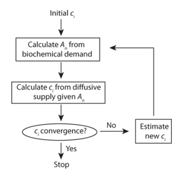
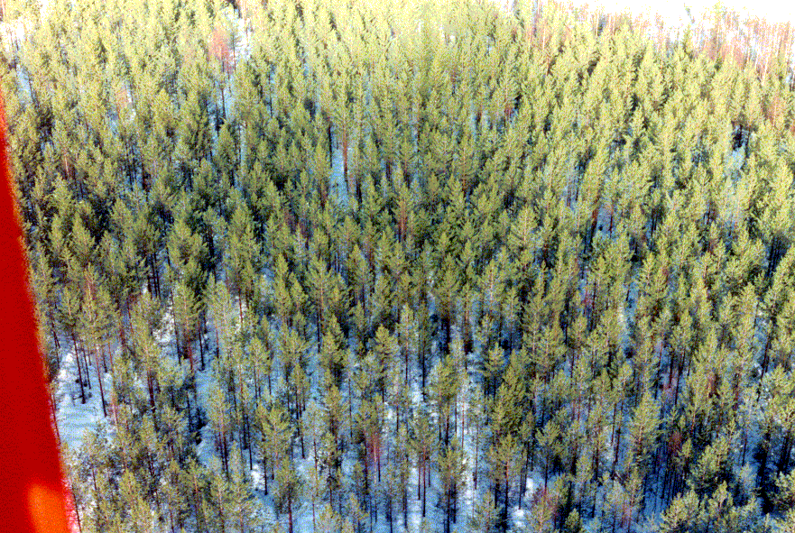

```{r, include=FALSE}
library(knitr)
library(kableExtra)
```

## Objectives of Practical B

During this second practical, we will further develop our leaf model to account for stomatal regulation and the vertical intragration of processes along the canopy. The FvCB model developped during Practical A is now coupled to a stomatal conductance model (the Ball-Berry model) and the light extinction model from Monsi and Saeki (1953) following an exponential Beer-Lambert law (Slide 15 of Lecture 3). 

During this practical you will have to apply this new model to an evergreen coniferous forest site in Finland and evaluate its performance by comparing its prediction with observations of carbon uptake at this site.

## Theory
### Estimating An, gs and Ci
In practical A, we re-coded the  Farquhar, von Caemmerer and Berry model for C3 photosynthesis. For reminder, this model computed the net assimilation rate ($A_n$) from the internal concentration in CO<sub>2</sub> ($c_i$) and atmospheric/leaf variables and parameters:

$$
A_n = FcVB(c_i,atmoshere,leaf)
$$
Yet, the internal concentration $c_i$ cannot be directly measured: only the atmospheric concentration in CO<sub>2</sub> ($c_a$). However, $c_i$ can be derived from the stomatal aperture and the diffusion of CO<sub>2</sub> into the stomatal cavity (see slide 36 of lecture 2):

$$A_n = \frac{g_{bw}}{1.4} (c_a - c_s) = \frac{g_{sw}}{1.6} (c_s - c_i)  = \frac{1}{1.4g_{bw}^{-1} + 1.6g_{sw}^{-1}} (c_a - c_i) $$

where $c_s$ is the CO<sub>2</sub> contentation at the leaf surface and $g_{bw}$ and $g_{sw}$ represent the boundary and stomatal conductances, respectively. To close the system of equations (there are three unknowns $c_i$, $g_{sw}$, and $A_n$ for only two equations), we will use in this practical the semi-empirical Ball-Berry model:

$$ g_{sw} = g_{min} + g_1 \frac{A_n}{c_s}h_s$$

where $g_{min}$ and $g_1$ are additional leaf parameters standing for the residual leaf conductance when stomatal are close and the slope of the relationships with $A_n$, respectively. In addition, $h_s$ is the relative humidity (in %) at the leaf surface supposed to be equivalent to the open-air one. To resolve the system of three unknowns and three equations, we will use a simple convergence algorithm presented during the theory lecture 2 (slide 42) and summarised in the following figure:

```{r f1, fig.cap='Algorithm to solve the set of equations', out.width='60%', fig.asp=.75, fig.align='center',echo=FALSE}

```

The initial guess of $c_i$ is plugged into the FvCB model and allows computing $A_n$ which is in turn used to calculate $c_s$ from the diffusion equation. $c_s$ can then be used to compute the stomatal conductance which serves to re-estimate $c_i$ until some convergence criterion is met. 

### Canopy integration
The equations above allow to estimate the assimilation rate at the leaf level. Now we need to integrate the information at the canopy level and at the site level. 

We implemented a second set of equations to reproduce the attenuation of the light into the canopy. The coefficient of light extinction into the canopy follows a Beer-Lambert law as described in Monsi and Saeki (1953). This representation is still commonly used in big-leaf models since it is efficient in term of computing ressources, and sufficient for several research questions which do not require an explicit representation of the canopy (refers to slide 15 and 16 of Lecture 3):
$$
I^{\downarrow}=I^{\downarrow}_{sky}e^{-K_bL}
$$
with $I^{\downarrow}$ the incident radiation reaching the LAI layer $L$ and depending on the direct beam extinction coefficient $K_b$.

This model simulates light transmission into an homogeneous medium without scattering. Practically, the canopy, represented by its leaf area index (LAI) is decomposed into several layers along the vertical profile. This decomposition accounts for the distribution of leaves, with more leaves at the bottom than at the top. For each layer we compute the extinction coefficient of light. This coefficient will then be applied to the incomming radiation. 

Following this decomposition, assimiliation is computed for each LAI layer but with the adjusted light environment. It means that each LAI layer is considered as a single leaf (big leaf model). Normally, other parameters will also depend on the canopy position, such as vcmax and jmax (see upcomming Lecture 6). However, for this practical, only light will be modified. 

Once assimilation is computed for each LAI layer, we integrate the flux at the canopy scale by weighting fluxes by their position into the canopy. Finally, canopy fluxes are integrated at the site level using the available information on the LAI of the site. 

## Site

We will apply this model to Hyytiala, Finland which is an Evergreen Needleleaf Forests. In other words, it is a land dominated by woody vegetation with a percent cover >60% and height exceeding 2 meters. Almost all trees remain green all year (see site image). Canopy is never without green foliage. The site is characterized by a Mean Annual Temperature of 3.8°C, a Mean Annual Precipitation of 709 mm and a LAI of 6.7. This site is part of the FLUXNET network, which means that an eddy-covariance tower is installed and measures both meteorological variable and ecosystem CO<sub>2</sub> fluxes every 30 minutes. These are the meteorological data that we will use to force our model. 

```{r f2, fig.cap='Photo of the modelled site', out.width='80%', fig.asp=.75, fig.align='center',echo=FALSE}

```

## Before the practical

We have coded for you the model described above. So you just need to download it from Ufora. 
The model is developed as an R package. It means that all the functions are in the R folder, and can be installed as any other package. 

For this practical, you can either use directly the functions that are in the R folder, or build the package in the Rstudio environment. 
In both case, start by opening the `Photosynthesis.Rproj` project. 

If you chose to work with the package (not mandatory, only if you are confortable with it), you can build it by pressing the "Install and Restart" button in the "Build" tab. 

In that case the package should be available for loading:
```{r, eval=TRUE}
library("Photosynthesis")
```


## Questions and report details

0. First explore the package functions. Compared to Practical A, we added two main functions: The core is the `canopy_fluxes` function that essentially takes care of all the steps described above. In particular, it calls the `Photosynthesis` function that solves the system of equations for each layer of vegetation. In addition `canopy_fluxes` aggregates the results for the entire canopy. Also pay attention to the `FvCB.model` function from Practical A that should be similar to the one you wrote yourself during the last practical. 

1. From now, we are going to build and run the photosynthesis/stomatal conductance model. To do so, follow the steps: 
* Create a new R script.
* Load the libray needed for the analysis
* Load the parameters needed to run the model
* Load the meteorological data provided with the Photosynthesis package
* Explore the meteorological data. Clean the file and remove non-sensical values if any. You can also decide to gap-fill the data with an average value. 
* Create a function that will call `canopy_fluxes` for each time step of the meteorological data. 

It should look like (example to compute the first 1000 time steps):

```{r, eval=FALSE}

rm(list = ls())

library(ggplot2)
library(Photosynthesis) # only if you work with the package, otherwise you need to load each function manually

# Check the parameters for the functions canopy_fluxes
?canopy_fluxes # only if you work with the package

# we load needed parameters
# leaf physiolofical parameters
leaf <- Load.LeafPhysiologyParams()

# Adapt leaf photosynthetic parameters corresponding to average values for boreal conifers (Step 4)
# leaf$vcmax25 = "value here" 
# leaf$jmax25 = "value here"
# leaf$alpha_l = "value here"

# We load meteo data from the fluxnet site
# In FLUXNET, NA value = -9999,
fluxnet_data<-read.table(file = "path/to/FLUXNET_FI-HYY_2006-2009.csv",header = TRUE,sep = ",",na.strings = -9999)
# FLUXNET variables: 
# TIMESTAMP YYYYMMDDhhmm --> Year, Month, Day, hour, min
# TA in °C
# SW in W m-2
# LW in W m-2
# VPD in hPa
# PA in kPa
# RH in %
# NEE in µmolCO2 m-2 s-1
# RECO in µmolCO2 m-2 s-1
# GPP in µmolCO2 m-2 s-1

# A good practice is always to explore your dataset (see question 2)
# Check and replace non-sensical values of met forcings here
apply(X=fluxnet_data,MARGIN = 2,FUN = min)
# We see that we have NA values for PA and RH
# Check the number of NA values for each year and for RH
table(fluxnet_data$YEAR[which(is.na(fluxnet_data$RH))])
# Check the number of NA values for each year and for PA
table(fluxnet_data$YEAR[which(is.na(fluxnet_data$PA))])

# It only represent a few hours in a full year. We will thus simply remove these lines. 
# A more classical solution is to replace the missing value with the average conditions around the same period. We talk about gap-filling
fluxnet_data<-na.omit(fluxnet_data)

# We check that it is correct now
apply(X=fluxnet_data,MARGIN = 2,FUN = min)

# Now we want to apply canopy_fluxes at each time step

siteLAI <- XXX # adapt here
apply.photosynthesis<-function(x,leaf,fluxnet_data){
  meteo<-fluxnet_data[x,]
  meteo$CO2<-380 # adapt here atmospheric CO2 concentration in ppm 
  gpp<-canopy_fluxes(meteo = meteo,leaf = leaf, LAI_layer = 20, LAI_tot = siteLAI)
  return(gpp)
}

N <- 1000 # number of timesteps to consider (Change here for Step 3)
results<-sapply(X = c(1:N),FUN = apply.photosynthesis,leaf=leaf,fluxnet_data=fluxnet_data)

# Plot and analyse the results here

# Don't forget, the flux tower provide the GPP of the ecosystem in µmolCO2 m-2 soil s-1, 
# And we compute gpp in µmolCO2 m-2 leaf s-1

# For Question 5, you need to modify the canopy_fluxes function and explore the new outputs here.
```

Follow the workflow and see if you understand the different steps. 

We ask you to draw (manually) the workflow of the model on a paper and the different call to the functions. This should contain the different functions and how the functions are called (use arrows). The workflow should also contain the names of input variables and output variables, and how variables are passed from one module to another. 
An example of workflow is the *Algorithm to solve the set of equations* presented above. 

You will have to upload a picture of your flowchart on Ufora (take a photo with your phone).

2. Explore the input (meterological) data (the FLUXNET_FI-HYY_2006-2009.csv file). Plot the seasonal and diurnal cycles of the following variables: air temperature, relative humidity, short-wave radiation, and atmospheric pressure that force the photosynthesis/stomatal conductance model. 

Do the same with the site GPP and compare the different year. What can you conclude from the site properties and the quality of data? 

3. Run the photosynthesis/stomatal conductance model for only 1 year that you will select based on the analysis of the meteorological variable and GPP. 
Compare your results with the observations with a critical viewpoint. Conclude about the robustness of the model. For example, you can ask yourself the following questions:

Does the modeled GPP match the data? Does it reproduces the seasonality? The daily variability? The average value? 

What could explain the discrepencies? 

What key process is missing and could help improve the results? Why? etc...

Try to be critical in your answer, both on the positive and negative aspects. 

4. For this final question, we ask you to modify the function `canopy_fluxes` to export two more variable. We would like to compare how our model is able to reproduce leaf assimilation of top-sun exposed leaves and bottom-shaded leaves. 

This two variables are already calculated in the model. Thus, you will simply have to extract and export the two new variables `gpp_top` and `gpp_bottom`. 
Rerun the model for the same year and compare the gpp simulated for sunlit and shaded leaves. 
